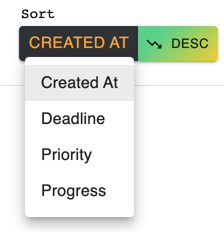
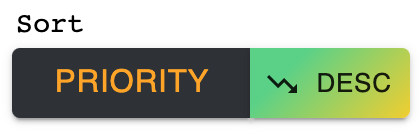
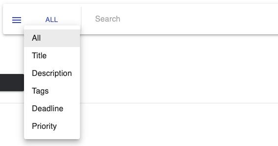
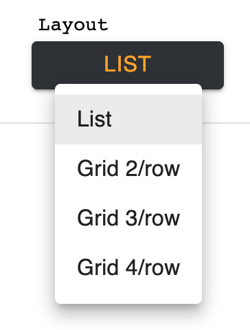

# Task Manager

* Table of Contents
{:toc}

--------------------------------------------------------------------------------------------------------------------

## **1. Introduction**
Hello there! If you are reading this, you must be curious about *Task Manager*.
*Task Manager* is a tool built help you manage and keep track of tasks. 
With Task Manager you can set deadlines, monitor progress, add tags, search for tasks and more!

--------------------------------------------------------------------------------------------------------------------

## **2. Quick Start**

1. Go to [https://dry-depths-11934.herokuapp.com/](https://breadpeanutbutter.github.io/task-manager/UserGuide.html). You should see something like the picture below.
2. The card-like boxes that you see are tasks. These are sample data loaded for you to play with.
3. To add your own task, click the Add Task button on the Homepage. Fill in the task details in the form and submit.
4. To edit a task, click the Edit icon on the task card and update the form.
5. To delete a task, click the Delete icon on the task card and click 'Ok' when prompted with a confirmation message.
6. To delete all tasks, click the Delete All Button on the Homepage and click 'Ok' when prompted with a confirmation message.

Read the next section to explore more features in more detail!

--------------------------------------------------------------------------------------------------------------------

## **3. Features**

### 3.1 Add Task

Click the 'Add Task' tab on the website header or the 'Add Task' button on the Homepage.

A task can have the following information fields:

Field       | Requirement      | Description
------------|------------------|-----------------------
Title       | Compulsory       | Title/name of a task. Cannot be empty.
Description | Optional         | Description of a task.
Priority    | Optional         | Priority of a task. Can take values *Low*, *Moderate* or *High*.
Deadline    | Optional         | Deadline of a task. Takes the format DD/MM/YYYY.
Progress    | Default value 0  | Progress of a task in percentage. Can take values 0-100.
Tags        | Optional         | Tags eg. can be used to represent custom categories. Can have multiple tags but no repeats. 

 
:memo: When adding tags, press the 'Enter' or ',' key to add a tag after typing it in the input box. 
This also means tags cannot have ',' characters in them.

:memo: Tags will appear as blue boxes below the input box if they have been successfully added.

:memo: To rearrange tags, use the mouse to drag and drop the blue tag boxes to the desired position.

### 3.2 Edit Task

Click the 'Edit' icon at the bottom right of the task card.

### 3.3 Delete Task

Click the 'Delete' icon at the bottom right of the task card.

:exclamation: This action is not reversible. Please make sure you want to do this before pressing the button.

### 3.4 Delete all Tasks

Click the 'Delete all' button on the Homepage.

:exclamation: This action is not reversible. Please make sure you want to do this before pressing the button.

:memo: You may use this to delete the sample data if you have no need for them anymore.

### 3.5 Sort Tasks

Click the 'Sort' button in the Homepage.
Toggle between four different sorting categories in either descending or ascending order.

:memo: When sorting by Deadline or Priority (optional fields), only tasks that have these fields present will show. 
For example, when sorting by priority, tasks that have no priority will not show since there is no reasonable
sorting order for them.

**Examples:**

:black_nib: To display tasks that have highest priority first:

:black_nib: To display tasks that have the closest deadlines first:

:black_nib: To display tasks that have the most progress first:

### 3.6 Search Tasks

Use the search box in the Homepage. Type a string in the search box and press the 'Enter' key.
Toggle between six different search options.

:memo: The search feature finds tasks which contain the specified search string, not just exact matches, and it is not case-sensitive.

:memo: The search feature can be used together with the sort feature to achieve more specific results.

:memo: When searching for Deadline , you can use '-', '/' or ' ' as date separators
eg. searching for'02-02-2021', '02/02/2021' and '02 02 2021' will all give the same results.

**Examples:**

:black_nib: To find tasks with Priority of *High*:

:black_nib: To find tasks with Deadline in the month of February:

:black_nib: To find tasks with Tags containing 'school':

### 3.7 Change Page Layout

Click the 'Layout' button in the Homepage.
Toggle between four different layouts to display your tasks on the Homepage.

 

Layout       | Description
-------------|------------------------------------
List         | Default layout
Grid 2/Row   | 2 tasks per row
Grid 3/Row   | 3 tasks per row. Not recommended for smaller screens.
Grid 4/Row   | 4 tasks per row. Not recommended for smaller screens.
 
:memo: Suitability of layout configuration might differ depending on screen size. For example,
a 27-inch monitor will be able to display the Grid 4/Row layout comfortably while a 13-inch monitor 
might not be wide enough to display 4 tasks per row nicely. 

--------------------------------------------------------------------------------------------------------------------